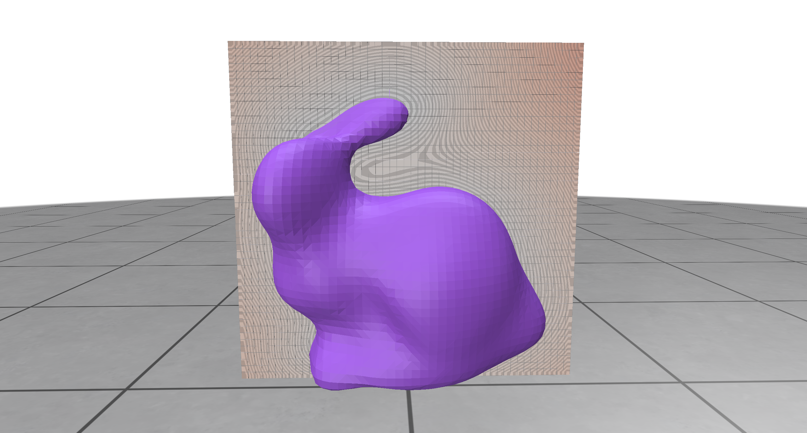

# Exercise - Learning a SDF with a Neural Network
In this exercise, you'll learn the basics of training a neural network by teaching it to approximate the Signed Distance Function (SDF) of our Bunny, who you first met in Exercise 4.

After completing the task and running the optimization in `demo.py` for some time, the result should look similar to this:



## Additional Information
Recall that SDF $ f(x): X \to \mathbb{R} $ of a subset $ \Omega $ in a metric space $ X $ with metric $ d $ is defined as 

$$
f(x) = \begin{cases} 
    -d(x, \partial \Omega) & \text{if } x \in \Omega, \\
    0 & \text{if } x \in \partial \Omega, \\
    d(x, \partial \Omega) & \text{if } x \notin \{\Omega \cup \partial \Omega\}. 
\end{cases}
$$

Here, $ d(x, \partial \Omega) $ denotes the distance from a point $ x \in X $ to the boundary $ \partial \Omega $ of the subset. If $ X $ is the Euclidean space $ \mathbb{R}^n $ and $ \partial \Omega $ is piecewise smooth, then the SDF has two important properties:

1. $ f(x) $ is differentiable almost everywhere. 
2. The gradient of the SDF satisfies the eikonal equation, i.e., $ \lVert \nabla f(x) \rVert = 1 $. 

Since a neural network can be understood as a parameterized function $ f_\theta(x) $ that is differentiable almost everywhere, it makes a great candidate for representing an SDF. The question then becomes: what objective function should $ f_\theta(x) $ minimize to accurately model the SDF after training? A simple approach would be to compute $ d(x, \partial \Omega) $ for a set of points and train the network using these point-distance pairs. However, there’s more clever way — one that lets us 'learn' the SDF even when $ \partial \Omega $ is unknown and we only have a set of points that lie on the boundary.


 1. We know that the SDF satisfies $f(x) = 0$ for all points on the boundary. To achive this our neural network is trained to minimize its output values for surface points:
  $$
 L_\text{surface} = \frac{1}{N_s} \sum_{i=1}^{N_s} | f_\theta(x_i)| 
 $$
 2. We also know that the SDF gradient is 1 almost everywhere, so our neural network $f_\theta(x)$ should have the same property. To achive this, the neural network minimizes an Eikonal-loss:
 $$
 L_\text{eikonal} = \frac{1}{N_e} \sum_{i=1}^{N_e}(\lVert \nabla f_\theta(x_i) \rVert_2 -1 )^2
 $$

 There’s one more objective function we need to introduce for practical reasons. Since we don’t train the network on the entire Euclidean space, we have to be mindful of the boundary we introduce. In particular, we want our network to output non-negative values at this addtional boundary — otherwise, the sign of the SDF might get flipped. To do so we add an additional loss:
$$
    L_\text{boundary} = \frac{1}{N_b} \sum_{i=1}^{N_b} \max(0, -f_\theta(x_i))
$$


The final objective function of the neural network is the weighted sum of the these objectives:
$$
\mathcal{L} = \lambda_\text{surface}L_\text{surface} + \lambda_\text{eikonal}L_\text{eikonal} + \lambda_\text{boundary}L_\text{boundary}.
$$

## Task

In `src/neural_sdf.py`:

1. **Implement the neural network by completing the `SDFMLP` class.** The network should be a 3-hidden-layer MLP with a width of `n_neurons`, using the non-linear activation function `activation_fn` between the first three layers. Choose the input and output sizes appropriately for learning an SDF.  

2. **Complete the `compute_network_gradient` function** to return the gradient of the network output with respect to the input, i.e., the function should compute $ \nabla f(x_i) $.  

3. **Implement the objective functions** described in the additional information section by completing the `forward` methods of the `SurfaceLoss`, `EikonalLoss`, and `BoundaryLoss` classes.  

4. **Complete the `Trainer` class:**  
   - In the constructor, set up the model and optimizer, using the Adam optimizer. Ensure that the MLP width, activation function, and learning rate match the constructor arguments.  
   - Implement the `step` function to perform a single forward and backward pass, minimizing the objective function $ \mathcal{L} $. The function should return the surface loss, eikonal loss, boundary loss, and weighted combined loss.  
   - Implement the `eval` function to return the MLP output. This function is intended for inference.  

5. **Train the neural network by running `demo.py`.**  

## General Remarks

The exercise will be graded based on the amount of successful unit tests. To run them, use

```bash
nox -s tests
```

<br/>
<center><h3>Good Luck!</h3></center>