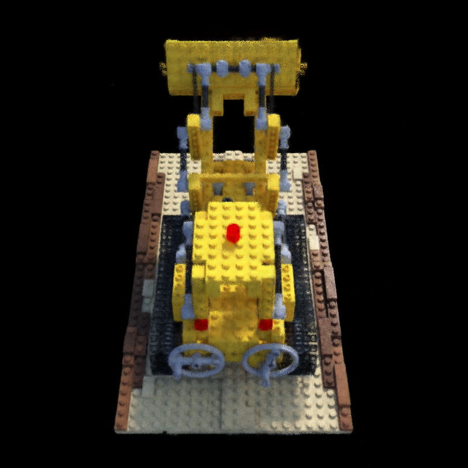

# Exercise - Training a simplified NeRF Model

In this exercise, you'll have a closer look at the implementation of the key components needed to train a NeRF.

After completing the task and running the optimization in `demo.py` for some time, the result should look similar to this:



## Additional Information

* This exercise uses the Instant-NGP NeRF model to keep training times reasonable. We skip the implementation of the neural network itself, but you may still find it interesting to look at its implementation in `demo.py` to see how the multi-resolution hash grid is used.
* While we train an actual NeRF model in this exercise, there is one major simplification: we do not attempt to perform importance sampling of the network's density field. Instead, we simply divide the ray into equally spaced segments and sample a random position within each segment. While this is a good starting point, you can imagine that many samples are wasted in low-density regions. Most approaches you will find in literature use some form of coarse-to-fine sampling, occupancy grids, or similar techniques to focus samples in high-density areas.

## Task

In `src/minimal_nerf.py`:

1. **Implement the positional encoding by completing the `PositionalEncoding` class.** The `n_output_dims` method should return the dimension of an encoded vector. The `forward` method must apply the encoding function  
    $$
    \gamma(p) := (\sin(2^0\pi p), \cos(2^0\pi p), \cdots, \sin(2^{L-1}\pi p), \cos(2^{L-1}\pi p))^T
    $$
    along the last dimension of its input and should return the higher-dimensional encoded vector.

2. **Complete the `create_rays` function.** Implement a function that transforms pixel coordinates into normalized ray directions using the transformation matrix (i.e. the camera pose matrix) and camera intrinsics. 
Here, we assume that the camera poses are defined in Blender convention. You can start with the OpenCV convention and then use `T_cv_to_blender` or `T_cv_to_blender_homogeneous` to go to Blender convention.
You can also assume that the focal length is the same for x- and y-direction, and that the principal point is in the exact center of the image.
The function should return the origins and directions of the constructed rays. The origins must be broadcast to match the view directions (i.e., the returned tensors should have the same size), and the directions should be normalized.

3. **Complete the `stratified_sampling` function.** Create a function that performs stratified sampling along each ray to determine the points at which the NeRF network will be queried. The function should return the interval boundaries, sampled positions as Cartesian coordinates, and the ray direction associated with each position.

4. **Complete the `volumetric_rendering` function.** Implement NeRF-style volumetric rendering. You can assume that $\hat{C}_\text{bg} = 0$.

5. **Complete the `forward` function.** Implement a function that performs a single forward pass by constructing rays, performing sampling, querying the model, and applying volumetric rendering. The method should return the resulting color values.

## General Remarks

The exercise will be graded based on the amount of successful unit tests. To run them, use

```bash
nox -s tests
```

<br/>
<center><h3>Good Luck!</h3></center>