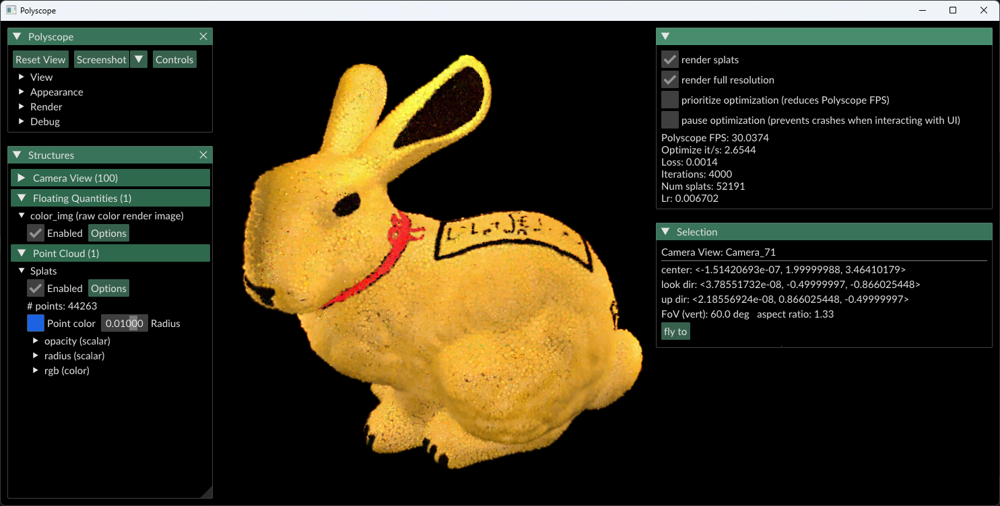

# Exercise - Gaussian Splatting

In this exercise, you will optimize a Gaussian splatting model from an initially estimated point cloud of an object (e.g. obtained through structure-from-motion).

If you completed the tasks you should see the reconstruction approaching an image like this after some minutes:



To see the output of the Gaussian renderer, set "color_img" to "Enabled" in the ""Floating Quantities" on the left.

Note: Because the optimization is very demanding, try not to click on the GUI elements too fast. Otherwise the GUI thread might crash and you have to start the optimization from scratch again.

## Tasks

In `src/gaussian_splatting.py`:

1. **Complete the `compute_jacobians` function.** Implement a function that computes the Jacobians of the projection function with respect to the 3D coordinates of the splats. Return a tensor of size `(N, 2, 3)`, where `tensor[k]` is the Jacobian of the projection function at the `k`-th splat.

2. **Complete the `get_covariance_2d` function.** Implement a funciton that computes the covariance of the 2D screen coordinates of the splats. It should return a tensor of size `(N, 2, 2)`, where `tensor[k]` is the covariance of the 2D screen coordinates of the `k`-th splat.

3. **Complete the `get_bounding_boxes` function.** Compute the bounding boxes of the splats in 2D screen coordinates. Return two tensors `min_xy` and `max_xy`, where `min_xy[k]` and `max_xy[k]` are the minimum and maximum 2D screen coordinates of the `k`-th splat, such that `num_std_devs` standard deviations in each direction are included.
Hint: Here you just have to find any bounding box that encloses the 2D splat centered at `(0, 0)` with the given 2D covariance.  This is used for speeding up the rendering, i.e. the better you choose the bounding box, the faster the rendering will get!

4. **Complete the `compute_alpha_blending_weights` function.** Compute the alpha blending weights for each gaussian at each pixel. Return a tensor of size `(N, H, W)`, where `tensor[k, y, x]` is the blending weight of the `k`-th gaussian at pixel `(y, x)`.

5. **Complete the `compute_image_positional_gradients` function.** Compute the gradients of the image loss w.r.t. to the 2D pixel position of the splats. Return a tensor of size `(N, 2)`, where `tensor[k]` is the gradient of the image loss w.r.t. the 2D image coordinates of the `k`-th splat.


## General Remarks

The exercise will be graded based on the amount of successful unit tests. To run them, use

```
nox -s tests
```
<center><h3>Good Luck!</h3></center>

<!-- In this exercise, you will optimize the diffuse texture of an object using differentiable rendering.

After completing the task, you should see the bunny with an unitialized texture. After some time, the optimization should look similar to this:


When enabling ```color_img```, you can see the rerendered version of the optimized material.

## Task

In `src/differentiable_renderer.py`:

1. Implement the conversion from an OpenCV projection matrix $K$ to an OpenGL Clip-Space Projection $P_{\mathrm{clip}}$.
2. Implement the gradient descent update step in ```gradient_descent```.
3. Compute the $L_1$-Loss between the estimated image and the target image in ```loss_L1```. Reduce the pixel-wise loss to a scalar using a sum reduction.
4. Implement the optimization step in ```optimize_step``` by rendering the image from each given camera view and accumulating the loss.


## General Remarks

The exercise will be graded based on the amount of successful unit tests. To run them, use
```
nox -s tests
```

<br/>
<center><h3>Good Luck!</h3></center> -->
