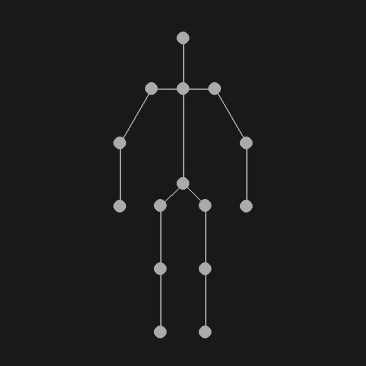

# Exercise - Inverse Kinematics

In this exercise, you will implement a simple version of the Jacobian method for inverse kinematics.

After completing the task, you should be able to manipulate a skeleton with your mouse input by dragging joints across your screen.



## Test

You can test your code interactively by using ```python demo.py 0``` for a chain or ```python demo.py 1``` for a simple skeleton.
Note that you have to implement all parts to manipulate the object.

## Task

In `src/inverse_kinematics.py`:

1. Compute the joint positions based on the parent, the link length and the world-space angle in ```compute_joint_positions```. Note that the root joint has to be set first and differently to all other joints. This individual treatment will continue in all following tasks.
2. Implement the jacobian computation in ```ik_jacobian```. \
Use the given information about the parents to determine and collect all non-zero derivatives. \
Reminder: the jacobian is given as $$J = \left(
    \begin{array}{cc|cccc}
        \frac{\partial x_0}{\partial x_0} & \frac{\partial x_0}{\partial y_0} & \frac{\partial x_0}{\partial \theta_1} & \frac{\partial x_0}{\partial \theta_2} & \cdots & \frac{\partial x_0}{\partial \theta_n} \\
        \frac{\partial y_0}{\partial x_0} & \frac{\partial y_0}{\partial y_0} & \frac{\partial y_0}{\partial \theta_1} & \frac{\partial y_0}{\partial \theta_2} & \cdots & \frac{\partial y_0}{\partial \theta_n} \\
        \frac{\partial x_1}{\partial x_0} & \frac{\partial x_1}{\partial y_0} & \frac{\partial x_1}{\partial \theta_1} & \frac{\partial x_1}{\partial \theta_2} & \cdots & \frac{\partial x_1}{\partial \theta_n} \\
        \frac{\partial y_1}{\partial x_0} & \frac{\partial y_1}{\partial y_0} & \frac{\partial y_1}{\partial \theta_1} & \frac{\partial y_1}{\partial \theta_2} & \cdots & \frac{\partial y_1}{\partial \theta_n} \\
        \vdots & \vdots & \vdots & \vdots & \ddots & \vdots \\
        \frac{\partial x_n}{\partial x_0} & \frac{\partial x_n}{\partial y_0} & \frac{\partial x_n}{\partial \theta_1} & \frac{\partial x_n}{\partial \theta_2} & \cdots & \frac{\partial x_n}{\partial \theta_n} \\
        \frac{\partial y_n}{\partial x_0} & \frac{\partial y_n}{\partial y_0} & \frac{\partial y_n}{\partial \theta_1} & \frac{\partial y_n}{\partial \theta_2} & \cdots & \frac{\partial y_n}{\partial \theta_n}\end{array}\right)$$
3. Compute the shift vector ```ik_shift``` based on the current positions and the target positions. Make sure you get the correct dimensions for the next step.
4. Solve the linear system of equations in ```ik_solve``` using ```torch.linalg.lstsq()```.
5. Update the angles and the joint positions in ```apply_changes``` using the solution from ```ik_solve```. Again, the root has to be updated individually.


## General Remarks

The exercise will be graded based on the amount of successful unit tests. To run them, use

```
nox -s tests
```

<br/>
<center><h3>Good Luck!</h3></center>
